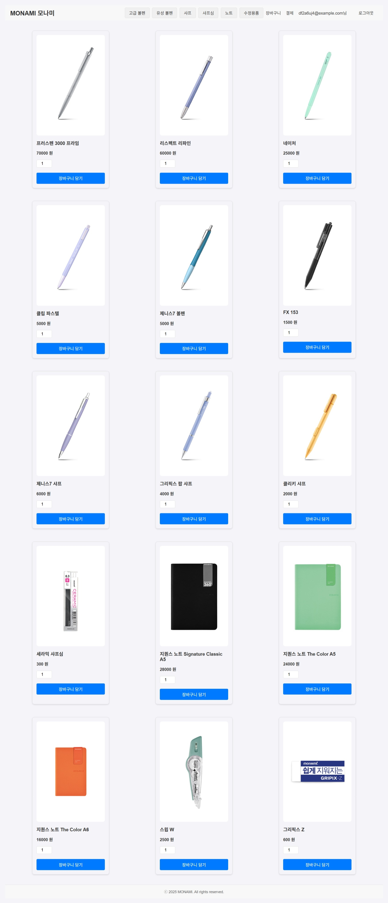
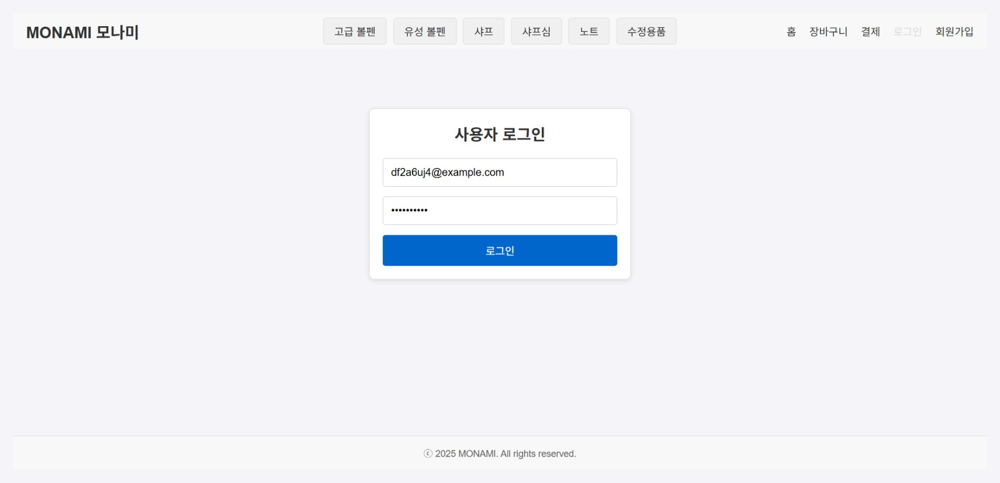
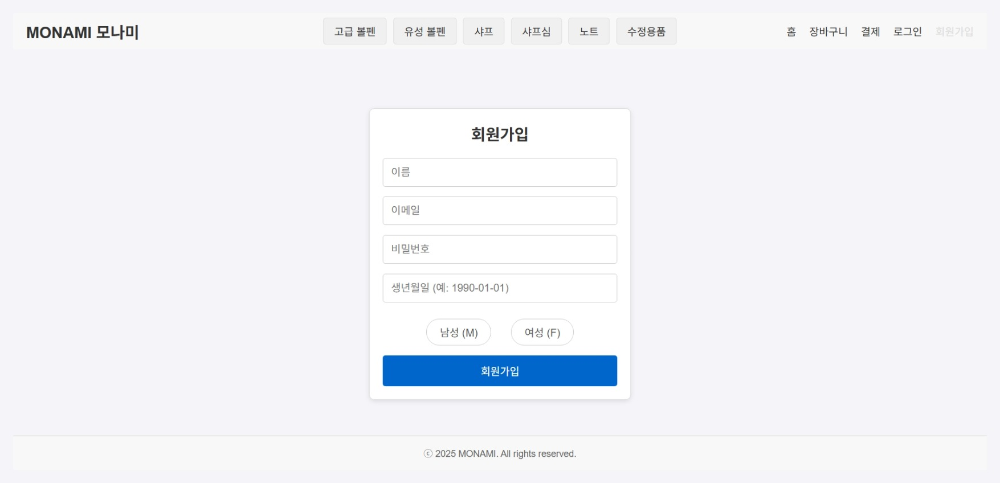
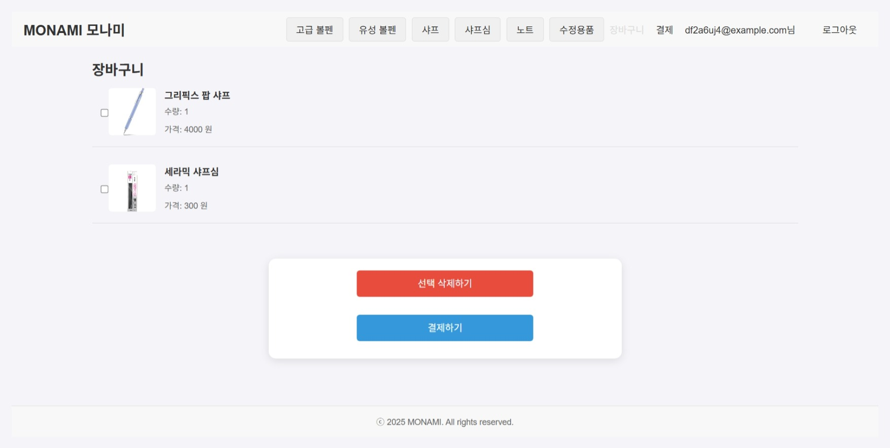
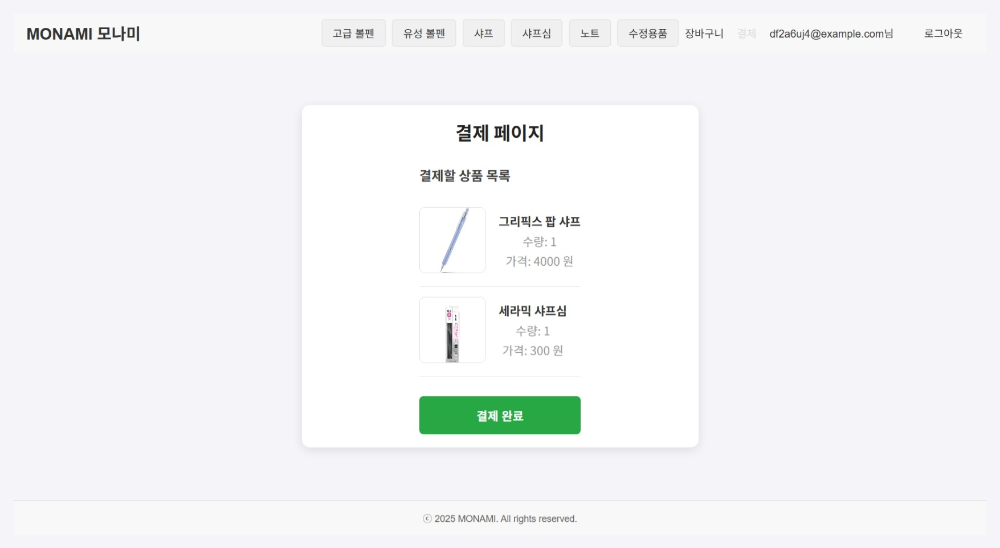
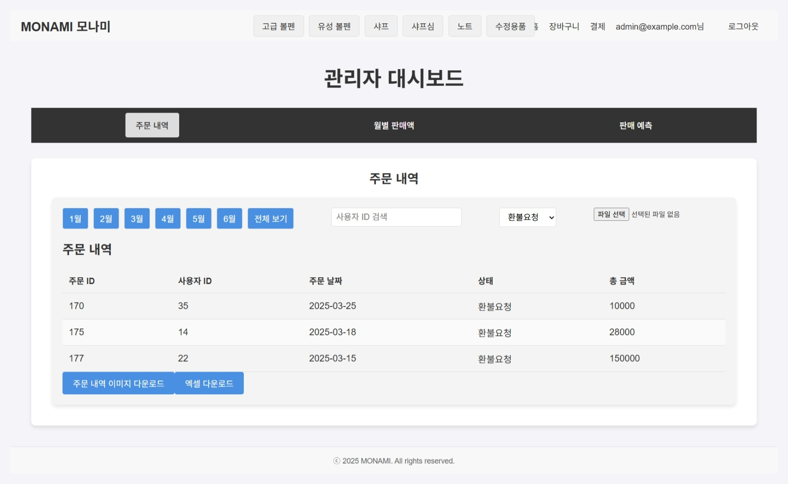

## 프로젝트명
Monami Client

React 기반으로 제작한 웹 애플리케이션입니다.  
프론트엔드와 백엔드를 모두 직접 구현했으며, 현재 리포지터리는 프론트엔드(React) 부분입니다.

---

## 프로젝트 개요
프로젝트명:Monami Client  
역할:프론트엔드 개발 (디자인, 상태관리, API 연동 포함) + 백엔드(STS4, MariaDB) 연동

## 기술 스택:  
  - React, React Router, Axios
  - STS4, MariaD
  - Styled-components / CSS 
  - GitHub 배포

---

## 주요 기능
- 회원가입 / 로그인  
- 장바구니  
- 결제 페이지  
- 관리자 대시보드
- 백엔드(Spring Boot)와 REST API 통신

---

## 주요 화면

## 메인 페이지

## 로그인

## 회원가입

## 장바구니 페이지

## 결제 페이지

## 관리자 대시보드

